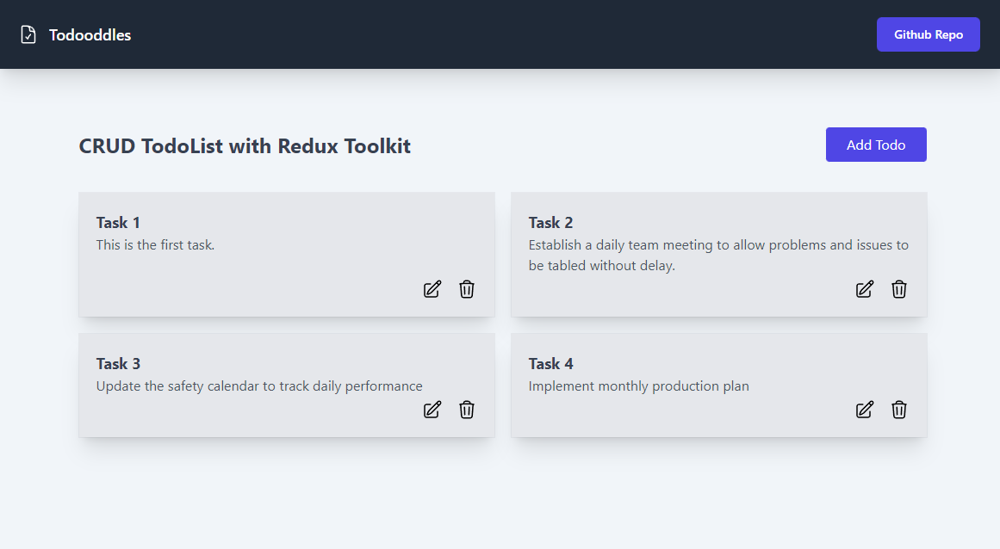

# :rocket: Todoodles | A React Redux Todo App

> Todoodles is a CRUD todo app created as a `Redux Toolkit` study.

[![GitHub repo size][github-img]][github-url]
[![GitHub last commit][github-commit]][github-url]

<!-- Badges to Add: Netlify build, twitter, license? -->

<p align="center">
  
</p>

## Features

Users can create, read, update and edit entries via Redux state management.

[DEMO](https://todoodles-redux-toolkit-tailwind-app.netlify.app/ "RTK Tailwind Todo Demo")

### Technology

1. Reactjs 18 | Installed using the Redux & Redux Toolkit template
2. Redux Toolkit | [Getting Started](https://redux-toolkit.js.org/introduction/getting-started)
3. React Router 6 | [React Router](https://reactrouter.com/en/v6.3.0/getting-started/overview)
4. TailwindCSS | [TailwindCSS](https://tailwindcss.com/docs/installation)
5. Redux DevTools for Chrome | [Dev Tools](https://chrome.google.com/webstore/detail/redux-devtools/lmhkpmbekcpmknklioeibfkpmmfibljd?hl=en)


## Getting Started

These instructions will give you a copy of the project up and running on your local machine for development and testing purposes. See deployment for notes on deploying the project on a live system.

### Development setup

Download and extract the Zip file or clone this repo your system.

After downloading/cloning this repo, go to its root directory and run:

```
$ npm i
$ npm start
```

## :books: Learning Resources

Tutorial
   - [CRUD Operations with React and Redux Toolkit](https://www.youtube.com/watch?v=SgnlgEEkqSo) by Cand Dev

Layouts with React Router 6
   - [React Router v6 Shared layouts](https://stackoverflow.com/questions/70236929/react-router-v6-shared-layouts)
   - [React Router Example](https://stackblitz.com/github/remix-run/react-router/tree/main/examples/basic?file=src%2FApp.tsx)

Use of Index Files
   - [How do index.js files work in React component directories?](https://stackoverflow.com/questions/44092341/how-do-index-js-files-work-in-react-component-directories)


## :memo: Notes

### 1. Nanoid
Nanoid is now part of React Toolkit, so you do not have to add a separate package unless your project requires a different universal identifyer.

### 2. React File Structure
Redux / Redux Toolkit currently recommends structuring files as Feature folders with all files for a feature in the same folder:

   - [Redux Style Guide](https://redux.js.org/style-guide/#structure-files-as-feature-folders-with-single-file-logic)

React File Structure
   - [File Structure from Reactjs](https://reactjs.org/docs/faq-structure.html)
   - [Delightful React File/Directory Structure](https://www.joshwcomeau.com/react/file-structure/)

### 3. Use of Index Files in Folders
As your React project grows, index files can really help clean up your file imports, making your code easier to read. This is especially useful for larger projects with multiple Redux slice reducers.

Instead of:
```
app.js

import { Routes, Route } from 'react-router-dom'
import AddTodo from "./features/todos/AddTodo";
import EditTodo from "./features/todos/EditTodo";
import TodoList from "./features/todos/TodoList";
import Layout from './components/Layout
import NotFound from './components/NotFound

function App() {
  return (
    <Routes>
      <Route path="/" element={<Layout />}>
        <Route index element={<TodoList />} />
        <Route path="add-todo" element={<AddTodo />}/>
        <Route path="edit-todo/:id" element={<EditTodo />}/>
        <Route path="*" element={<NotFound />}/>
      </Route>
    </Routes>
  );
}

export default App

```
In projects with multiple slice reducers, the imports list would grow exponentially and cause the code to be hard to read. Use cleaner imports:
```
app.js

import { Routes, Route } from 'react-router-dom'
import { TodoList, AddTodo, EditTodo } from './features/todos'
import { Layout, NotFound } from './components'

function App() {
  return (
    <Routes>
      <Route path="/" element={<Layout />}>
        <Route index element={<TodoList />} />
        <Route path="add-todo" element={<AddTodo />}/>
        <Route path="edit-todo/:id" element={<EditTodo />}/>
        <Route path="*" element={<NotFound />}/>
      </Route>
    </Routes>
  );
}

export default App
```
Sample Index:
```
components/index.js

import Button from "./Button";
import Header from "./Header";
import Layout from "./Layout";
import NotFound from './NotFound'
import TextField from "./TextField";
import FormContainer from "./FormContainer";

export { Button, Header, Layout, TextField, NotFound, FormContainer }

```

<!-- Markdown link & img dfn's -->
[github-img]: https://img.shields.io/github/repo-size/lisawagner/rtk-tailwind-todo?logo=github&style=flat-square
[github-url]: https://github.com/lisawagner/rtk-tailwind-todo
[github-commit]: https://img.shields.io/github/last-commit/lisawagner/rtk-tailwind-todo?logo=github&style=flat-square